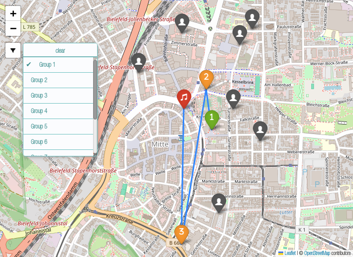

# Running Dinner
In this project, the organization of a running dinner is optimized, in which different groups participate, each of which hosts an event (appetizer, main course, dessert).
If a group does not host an event, it visits another group.
The maximum travel time between consecutive events should be minimized.

## Problem Instance
A problem instance consists of a set of groups $G$ and a set of locations $V$, where these sets are usually identical since the groups themselves are hosts.
There should be exactly $k$ groups at the same location for an event.
In addition, there is a set of events $E$ consisting of a start event $0$, end event $n+1$ and usually three main events in between, namely appetizer, main course and dessert.
To minimize the maximum travel time between the events, the travel time $d_{v, w}$ between each pair of locations $v$, $w$ is also required.
<div align="center">
  
Notation | Description
---: | :---
$g \in G$ | group
$k \in \mathbb{N}$ | number of groups at the same location for an event
$v \in V$ | location
$v_g \in V$ | home location of group $g$
$e \in \lbrace 0, \ldots, n+1 \rbrace = E $ | event
$e_g \in E$ | event where group $g$ is a host
$h \in H_e$ | one host of event $e$, i.e. $e = e_h$
$d_{v, w} \in \mathbb{R}_{\ge 0}$ | distance between locations $v$ and $w$
$P_1, P_2, P_3 \in \mathbb{R}_{\ge 0}$ | cost for different kind of penalties
  
</div>

## Mixed-Integer Programming Problem
The problem is formulated as a mixed-integer programming problem to be solved later by calling a solver from Python through [PuLP](https://github.com/coin-or/pulp).
The model is explained in terms of the [variables](#variables), the [objective](#objective) and the [constraints](#constraints).

### Variables
Variables $x$ assigns a group to the location of a host group for an event.
Variable $t$ specifies the maximum travel times between events, which depend on the individual travel times of the groups.
The remaining variables are auxiliary variables.
Variable $y$ checks whether two groups meet at an event.
The $z$ variables are relevant for possible penalty costs and store whether there are too few or too many groups at the same location for an event and whether some groups meet more than once.
<div align="center">
  
Variable | Description
---: | :---
$x_{g, h} \in \lbrace 0, 1\rbrace$ | Does group $g$ visit the event $e_h$ at location $v_h$ of host $h \in G$?
$t_e \in \mathbb{R}_{\ge 0}$ | maximum travel time from event $e \in \lbrace 0, \ldots, n \rbrace$ to the next event
$y_{g, g', h} \in \lbrace 0, 1\rbrace$ | Do groups $g$ and $g'$ meet at location $v_h$ for event $e_h$ of host $h \in G$?
$z^{1}_{h} \in \lbrace 0, 1\rbrace$ | Are there $k-1$ groups at location $v_h$ for event $e_h$ of host $h \in G$?
$z^{2}_{h} \in \lbrace 0, 1\rbrace$ | Are there $k+1$ groups at location $v_h$ for event $e_h$ of host $h \in G$?
$z^{3}_{g, g'} \in \mathbb{Z}\_{\ge 0}$ | How many times more than once do the groups $g$ and $g'$ meet?

</div>

### Objective
The aim is to minimize the maximum travel times between events in order to enable an efficient process.
Since the individual events are of equal value, an unweighted sum of the maximum travel times between the events can be used.
```math
\min \sum_{e = 0}^n t_e
```

The penalty cost for relaxing some constraints can be added to the objective function.
This is done in the form of a weighted sum with the weights $P_1$, $P_2$ and $P_3$ defined above.
```math
\min\ \sum_{e = 0}^n t_{e} + P_1 \cdot \sum_{v \in V} \sum_{e \in E} z^{1}_{v, e} + P_2 \cdot \sum_{v \in V} \sum_{e \in E} z^{2}_{v, e} + \frac{P_3}{2} \cdot \sum_{g \in G} \sum_{g' \in G} z^{3}_{g, g'}
```

### Constraints
- First, the main variables $x$ and $t$ must be linked by the constraints.
The variables $x$ are influenced by other constraints and in turn provide the necessary lower bound on the maximum travel times in the objective function.
The maximum travel time between consecutive events is an upper bound on the travel times of the groups between the locations they visit at these events.
<ul>
  <ul>
    <li>At the beginning, each group $g$ travels from its home location $v_g$ to the location $v_h$ of its first host $h$.</li>
  </ul>
</ul>

```math
\sum_{h \in H_1} d_{v_g, v_h} \cdot x_{g, h} \le t_0 \qquad \forall g \in G
```
<ul>
  <ul>
    <li>Next, groups travel between consecutive main events $\lbrace 1, \ldots, n \rbrace$. The following equation shows a set of lower bounds that influence the maximum travel time.</li>
  </ul>
</ul>

```math
d_{v_h, v_{h'}} \cdot (x_{g, h} + x_{g, h'} - 1) \le t_e \qquad \forall g \in G, e \in \lbrace 1, n-1 \rbrace, h \in H_e, h' \in H_{e+1}
```
<ul>
  <ul>
    <li>There are two options for the final event:</li>
    <ul>
      <li>Either each group goes back to its home location.</li>
    </ul>
  </ul>
</ul>

```math
\sum_{h \in H_n} d_{v_h, v_g} \cdot x_{g, h} \le t_n \qquad \forall g \in G
```
<ul>
  <ul>
    <ul>
      <li>Or all the groups meet up for a joint party at a special location $v_s$.</li>
    </ul>
  </ul>
</ul>

```math
\sum_{h \in H_n} d_{v_h, v_s} \cdot x_{g, h} \le t_n \qquad \forall g \in G
```

- There are multiple constraints on the assignment of groups to hosts. Each group must visit exactly one group for each main event.
```math
\sum_{h \in H_e}x_{g, h} = 1 \qquad \forall g \in G, e \in \lbrace 1, \ldots, n \rbrace
```

- Each group visits itself when it hosts.
```math
x_{g, g} = 1 \qquad \forall g \in G
```

- If a group is hosting an event, three groups must be present. Deviations are penalized.
```math
\sum_{g \in G} x_{g, h} = 3 - z^{1}_h + z^{2}_h \qquad \forall h \in G
```

- Variable $y$ stores if two groups meet during a main event. For easier notation and due to symmetry, each occurence is stored twice which is avoided in the implementation.
```math
x_{g, h} + x_{g', h} \le 1 + y_{g, g', h} \qquad \forall g, g', h \in G
```

- Teams may only meet up to once. Variable $z^{3}$ stores how many more times than once groups meet. Due to symmetry the occurences are counted twice and so the penalties in the [objective function](#objective) are halfed.
```math
\sum_{h \in G} y_{g, g', h} \le 1 + z^{3}_{g, g'} \qquad \forall g, g' \in G
```

## Implementation
There is one [example file](example.py) which is discussed in [Example](#example).
Other than that there are the following five classes stored in [model](model).

#### [DinnerInstance.py](model/DinnerInstance.py)
This class stores a running dinner problem instance. It provides methods to solve the problem and store the solution as csv file or visualize it in an html file using [folium](https://github.com/python-visualization/folium).

#### [Group.py](model/Group.py)
Represents a group with a name, [location](#locationpy), and an event ID indicating which event the group hosts.

#### [Location.py](model/Location.py)
Represents a location with [coordinates](#coordinatespy). Can be created using an address, for which [OpenRouteService](https://openrouteservice.org/) is used.

#### [Coordinates.py](model/Coordinates.py)
Represents geographical coordinates.

#### [TravelTimes.py](model/TravelTimes.py)
Stores travel times between [locations](#locationpy), which are calculated using [OpenRouteService](https://openrouteservice.org/).

## Example
The [example file](example.py) consists of a problem instance with 10 groups at random locations in Bielefeld in Germany, each within walking distance of each other. There are 5 events including a joint after party which takes place at a central location.

The solution is stored in a [csv file](example-solution.csv) which can be seen in the following table.
<div align="center">

| Group   | Appetizer | Main&nbsp;Course | Dessert    |
|---------|-----------|------------------|------------|
| Group 1 | Group 1   | Group 5          | Group 9    |
| Group 2 | Group 2   | Group 6          | Group 10   |
| Group 3 | Group 3   | Group 5          | Group 9    |
| Group 4 | Group 4   | Group 7          | Group 8    |
| Group 5 | Group 2   | Group 5          | Group 8    |
| Group 6 | Group 2   | Group 6          | Group 8    |
| Group 7 | Group 4   | Group 7          | Group 10   |
| Group 8 | Group 1   | Group 6          | Group 8    |
| Group 9 | Group 3   | Group 5          | Group 9    |
| Group 10| Group 4   | Group 7          | Group 10   |
</div>

A visualization of the solution is stored in an [html file](example-map.html) and can be seen in the following image.
<div align="center">


</div>
